---
title: "Progetto Fondamenti Scienza Dati"
author: "di Ashean Abeysinghe"
output: 
  ioslides_presentation:
    css: style.css
    incremental: yes
editor_options: 
  chunk_output_type: inline

---

```{r setup, include=FALSE}
knitr::opts_chunk$set(cache = TRUE, message = FALSE, warning = FALSE)
```


## Dataset 
Nel seguente progetto procederemo con l'analisi di dati raccolti sulla produzione e consumazione delle carni a livello mondiale

*dataset usati:*

1. "[FAO-Dataset](https://www.kaggle.com/dorbicycle/world-foodfeed-production)", 
2. "[Worldwide consumption of different meats by country from 1991](https://www.kaggle.com/vagifa/meatconsumption)",

## Domande iniziali

  1. Quanta carne mangiamo?
  
  2. Come è variata la nostra dieta negli ultimi 50 anni?
  
  3. La produzione di carne è cresciuta in rapporto alla popolazione?
  
  4. Consumiamo veramente tutta la carne che produciamo?
  

  

## Studiamo le produzioni delle seguenti carni .

Nei seguenti grafici vederemo l' andamento della produzione delle carni più comuni dal 1961 al 2013

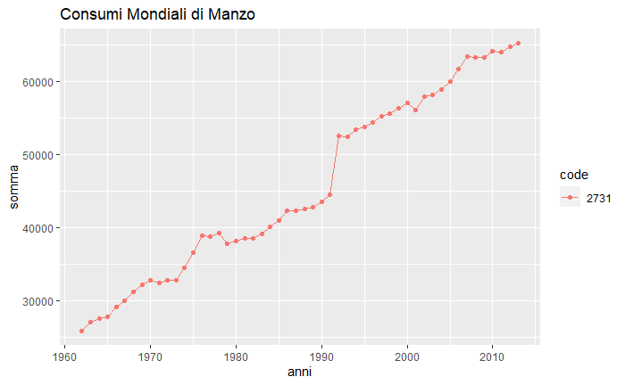
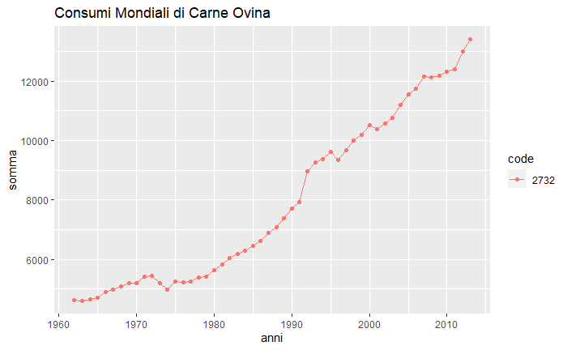
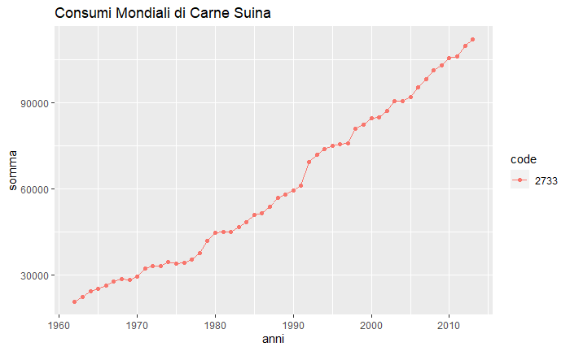


## Un quadro generale
Notiamo che la produzione è sensibilmente in aumento in tutto il mondo. 
**Quando abbiamo cominciato a mangiare questa quantità di carne?**

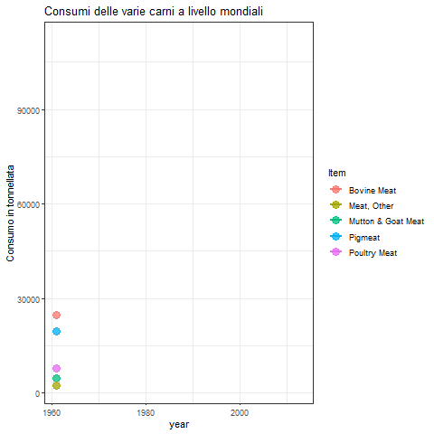

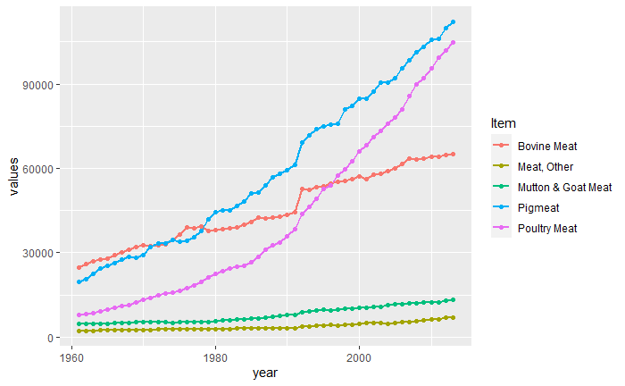


Notiamo in tutti i grafici che la produzione di carne è aumentata in modo sensibile in tutto il mondo.
 

**La crescita della produzione di carne è cresciuta in rapporto alla popolazione? **


Vediamo che il rapporto tra la popolazione mondiale di alcune carni come quella ovina sono rimaste più o meno costanti,tra queste, inaspettatamente, anche **il rapporto tra manzo e poplazione è rimasta più o meno costante**, mentre la produzione di **carne suina e pollame ha tenuto un andamento crescente**

## Quanta carne produciamo nelle varie nazioni?

Dai precedenti grafici abbiamo studiato la crescita delle produzioni di carne a livello globale, proviamo a visualizzare quali sono effettivamente i   paesi che oggi  consumano più carne

 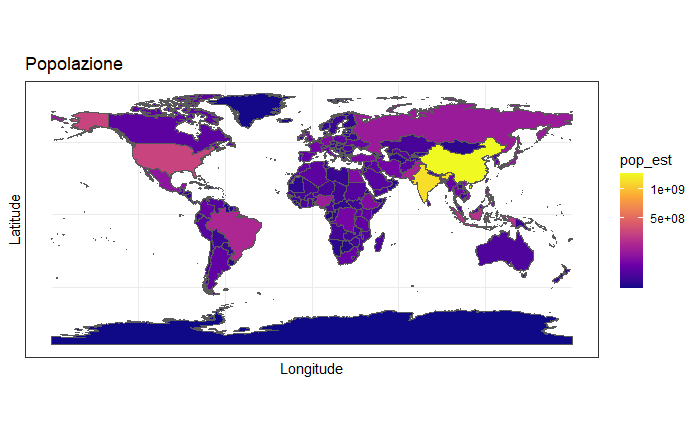
 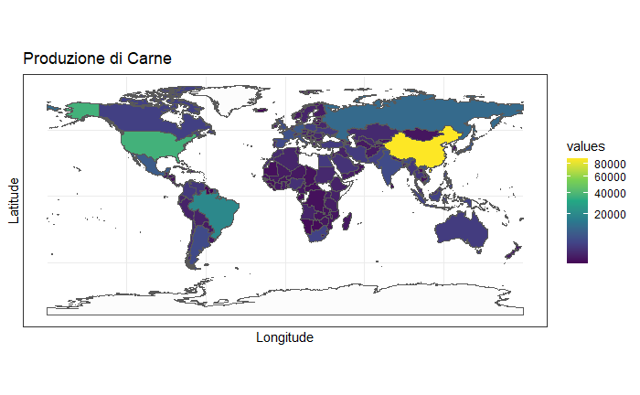
 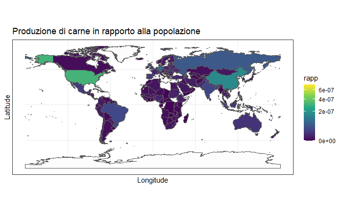
 
 
## Il consumo di carne?
 Fino ad adesso abbiamo visto la produzione di carne nei vari paesi, ma cosa possiamo dire riguardo al consumo?
 Nelle successive slides, per consumo, intenderemo, più semplicemente, la quantità di carne acquistata.
 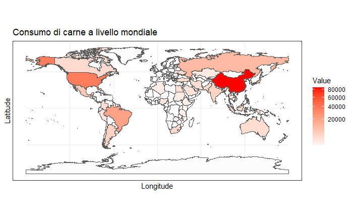
 In rapporto alla popolazione
  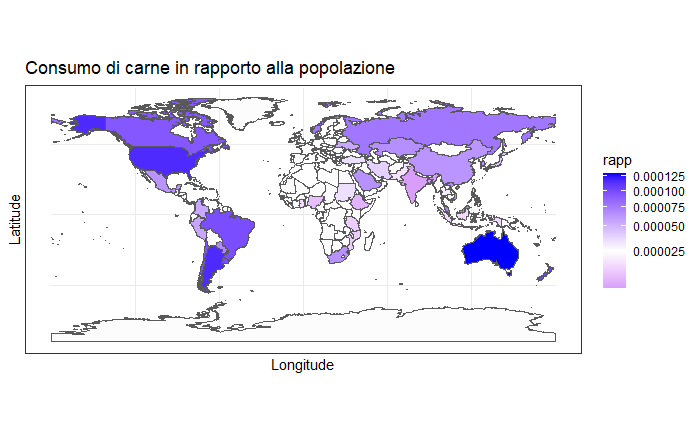
  
## Crescita dei consumi di carne (dal 1990-2020)
Creiamo un grafico dove mettiamo in rapporto il consumo di carne a livello mondiale ed tempo:
  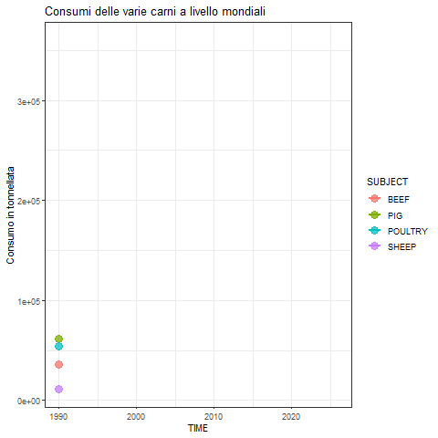
   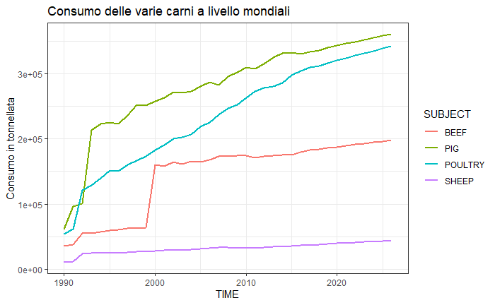
   
   
## Rispondiamo alla 4° domanda
   "Consumiamo veramente la carne che produciamo?"
  
   Per rispondere effettivamente a questa domanda dobbiamo mettere a confronto le quantità di carne prodotta con le quantità di carne consumata, sfruttiamo la regressione lineare semplice visualizzandola su uno scatterplot.
   
   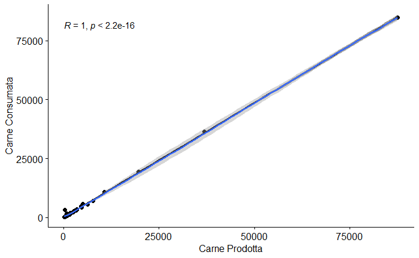
   
   Come possiamo notare, il valore di R (coefficiente della correlazione di Pearson) è uguale a 1!
   