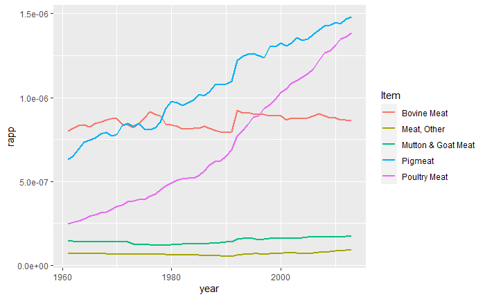

Nel seguente progetto procederemo con l'analisi di dati raccolti sul consumo di carne,
l'inquinamento e la sanità, quanto quel che mangiamo affligge la nostra salute e quella del nostro pianeta? 

*dataset usati:*

1. "[FAO-Dataset](https://www.kaggle.com/dorbicycle/world-foodfeed-production)", 
2. "[Worldwide consumption of different meats by country from 1991](https://www.kaggle.com/vagifa/meatconsumption)",
3. "[Greenhouse gas emissions](https://github.com/owid/co2-data/blob/master/owid-co2-data.csv)".
4. "[Migration & Population Density WorldBank 1960-2018](https://www.kaggle.com/eliasdabbas/migration-data-worldbank-1960-2018?select=migration_population.csv)."

**Domande iniziali**
Partiamo con un paio di domande semplici:

  1. quanta carne mangiamo nelle varie nazioni?
  (grafico nazioni x consumo di carne)
  
  2. Quando abbiamo cominciato a mangiare questa quantità di carne?
  (grafito crescita consumi in occidente)
  
  3. I paesi del terzo mondo hanno incominciato più tardi a consumare carne, coincide con la crescita economica del paese?
  
  4. Quali sono i paesi con maggiori emissioni, quante di queste emisisoni sono dovuti agli allevamenti?
  
  5. Quali sono i paesi con maggiori problemi di obesità ed con più decessi per colestorolo alto?
  
  6. Quanto costano alle varie nazioni?
  
  
  
  

**Studiamo i consumi delle seguenti carni .**

Nei seguenti grafici vederemo l' andamento del consumo delle carni più comuni dal 1961 al 2013

Notiamo in tutti i grafici il cosumo di carne è aumentato in modo sensibile in tutto il mondo. 
**Ma in rapporto alla popolazione cosa possiamo dire?**

>Vediamo che il rapporto tra la popolazione mondiale di alcune carni come quella ovina sono rimaste più o meno costani, inaspettatamente anche **il rapporto tra manzo e poplazione è rimasta più o meno costante**, mentre il consumo di **carne suina e pollame ha tenuto un andamento crescente**.
